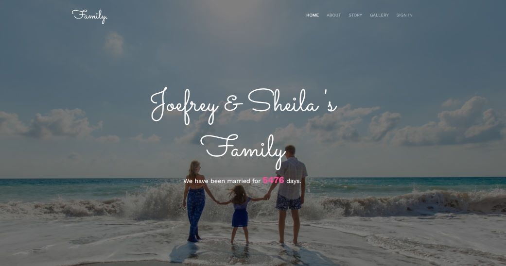
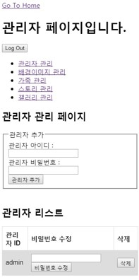

# Spring과 JSP를 활용한 가족 홈페이지
## 가족 홈페이지 소개
- 메인 페이지   
    
- 가족 구성원 소개 페이지   
       
    
- 가족 스토리 페이지   
    
- 가족 사진 앨범 페이지   
    

## 데이터 베이스 소개
- mysql 사용   
    

## 회원관리 구현
- 스프링 시큐리티를 사용하여 회원관리 구현   
    

## 관리자 페이지 구현
- CMS 처럼 관리자 페이지 구현   
    

## 관리자 페이지 기능
- 배경 이미지 교체   
    
- 가족 정보 관리   
    
- 가족 구성원 관리 기능  
    
- 가족 스토리 관리 기능   
    
    

## 부트스트랩 기반으로 만든 반응형 웹   

